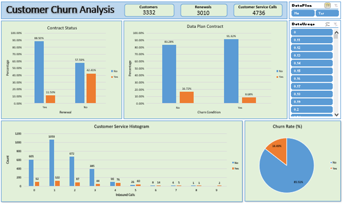

# Context
With the rapid development of telecommunication industry, the service providers are inclined more towards expansion of the subscriber base.To meet the need of surviving in the competitive environment, the retention of existing customers has become a huge challenge. It is stated that the cost of acquiring a new customer is far more than that for retaining the existing one. Therefore, it is imperative for the telecom industries to use advanced analytics to understand consumer behavior and in-turn predict the association of the customers as whether or not they will leave the company.

## Business Questions
- What variables are contributing to customer churn?
- Who are the customers more likely to churn?
- What actions can be taken to stop them from leaving?

## Dashboard/Analysis

## Insights
- 14.49% of the 3,333 customers have churned.
- Customers who make five or more customer service calls have the highest chance of churning.
- Churning customers call customer service 35% more often than others.
- On average, customers who spend the most time on calls tend to churn.
- 11.5% of customers who recently renewed their contracts have churned. Conversely, among those who have not renewed, the churn rate increases to 42.41%.
- Customers who use data without having a data plan are most likely to churn. Approximately 13.46% of customers who use data without a data plan will churn, compared to 8.71% of those with a data plan.

## Recommendations
- Churn Rate: Implement a loyalty program to reward long-term customers and reduce churn. Regularly analyze customer feedback to identify and address pain points. Conduct exit surveys with churning customers to understand their reasons for leaving and take corrective actions.
- Customer Service Call Frequency: Conduct a thorough review of customer service procedures and ensure they are up to date and effective. Train customer service representatives to better handle recurring issues and enhance customer satisfaction. Implement a follow-up protocol to check on the resolution of frequent callers' issues. Use data analytics to identify patterns and address systemic problems in customer service.
- Call Duration: Investigate the reasons behind longer call durations and the dissatisfaction of these customers. Establish a feedback loop where frequent and long-duration callers are given special attention, possibly through dedicated account managers. Enhance customer service training to ensure calls are more efficient and solutions are provided promptly. Offer personalized services or incentives to high-frequency users to show appreciation and address their concerns proactively.
- Contract Renewals: Focus retention efforts on customers approaching the end of their contract period with targeted renewal incentives and personalized offers. Monitor the satisfaction levels of customers throughout their contract to address any issues before renewal. Use predictive analytics to identify customers at risk of not renewing and engage them with tailored retention strategies.
- Data Usage and Data Plans: Promote data plans to customers who frequently use data but do not have a plan. Offer special discounts or promotions for data plans to high data users. Educate customers on the cost benefits and added features of data plans to encourage adoption. Implement a proactive outreach strategy to identify and convert customers who are at high risk of churning due to data usage patterns.
